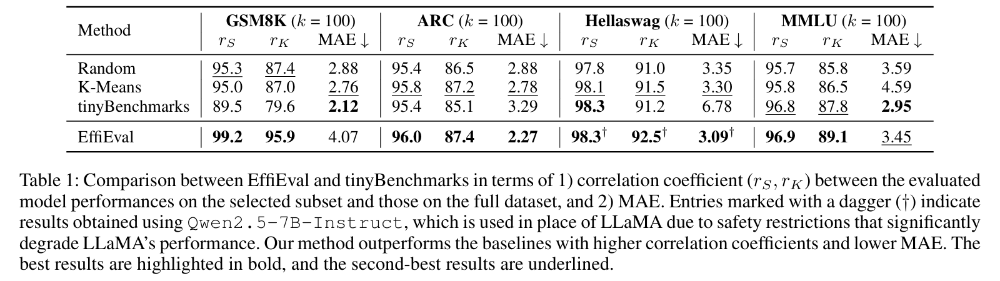

## 🔑 Key Takeaways
> - **Training-free efficient benchmarking** — EffiEval is a training-free approach that mitigates data redundancy while preserving evaluation reliability.
> - **Representativeness, fairness, and generalizability** — EffiEval maximizes capability coverage based on Model Utility Index (MUI), selects subsets independent of model performance, and generalizes across datasets and model families.
> - **High efficiency with minimal data** — Achieves Kendall’s $\tau > 0.9$ using only ~ 5% of the original data.

<a id="abstract"></a>

## 1 Introduction
With the rapid growth of large language models (LLMs), existing benchmarks such as MMLU and HELM require hundreds of GPU hours per evaluation, causing costs to surge. We propose **EffiEval**, a training-free benchmarking method that mitigates data redundancy while preserving evaluation reliability. EffiEval meets three criteria: 

- **representativeness** (comprehensive capability coverage);
- **fairness** (selection independent of model performance);
- **generalizability** (transferable across datasets and model families).

Using the Model Utility Index (MUI), it adaptively selects small yet representative subsets, achieving ranking consistency (τ > 0.9) with only a fraction of the data. Experiments on multiple benchmarks and LLMs confirm its efficiency, scalability, and robustness, offering a practical solution for reliable and cost-effective evaluation.

## 2 EffiEval

> **Key idea：** 


### 2.1 Model Utility Index(MUI)
MUI ([Cao et al.](https://arxiv.org/abs/2504.07440)) quantifies the ratio of neurons activated by task $t$ to the total number of neurons: 


$$
\textbf{MUI}(t)=\frac{N_\text{activated}(t)}{N_\text{total}}
$$


Intuitively, $\textbf{MUI}(t)$ characterizes the capabilities invoked by the model when performing task $t$. Given a full dataset $\mathcal{T}$, we aim to retain a small subset $S$ that represents the original dataset. From the perspective of capability coverage, this objective is equivalent to maximizing the MUI:


$$
S=\arg\max_{S\subseteq\mathcal{T}} \textbf{MUI}(S)=\arg\max_{S\subseteq\mathcal{T}}|\bigcup_{t\in S}N_\text{activated}(t)|
$$

### 2.2 Greedy Maximum Coverage

The optimization objective in Section 2.1 is equivalent to solving a Maximum Coverage Problem. Since the number of neurons in LLMs is large, an exact solution is infeasible. Therefore, we employ a greedy algorithm to solve this problem. The pseudocode of the algorithm is provided in the paper as *Algorithm 1*, with a complexity of $O(k \cdot K)$ and an approximation ratio of $(1 - 1/e)$.

## 3 Experiments




For more results and settings of $k$, please refer to the main text of the paper. The experiment results demonstrate that EffiEval efficiently selects small, representative subsets that closely reflect full-dataset evaluation while reducing computational costs.

## 4 Conclusion

In the era of large language models, evaluating performance can be costly and time-consuming. **EffiEval** is a training-free method that selects small, representative benchmark subsets while maximizing model capability coverage via the MUI. It ensures **representativeness, fairness, and generalizability**. Experiments on multiple public benchmarks show that EffiEval closely matches full-dataset evaluation while greatly reducing computational cost. Flexible and scalable, it lets users balance **evaluation efficiency and coverage**, making reliable benchmarking practical for a wide range of LLMs.


---

## 📜 BibTeX

If you find this work helpful, please consider citing:

```bibtex
@misc{cao2025effievalefficientgeneralizable,
      title={EffiEval: Efficient and Generalizable Model Evaluation via Capability Coverage Maximization},
      author={Yixin Cao and Jiahao Ying and Yubo Ma and Yugang Jiang and Yaoning Wang},
      year={2025},
      eprint={2508.09662},
      archivePrefix={arXiv},
      primaryClass={cs.CL},
      url={https://arxiv.org/abs/2508.09662},
}
```
